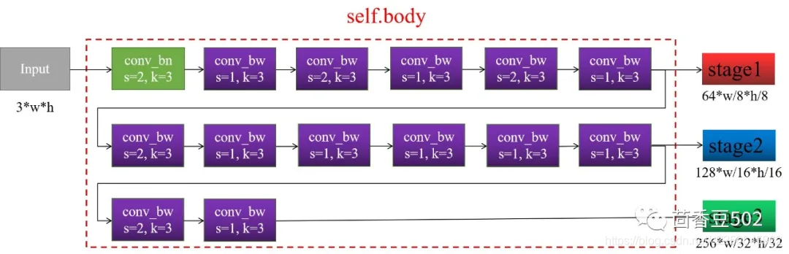
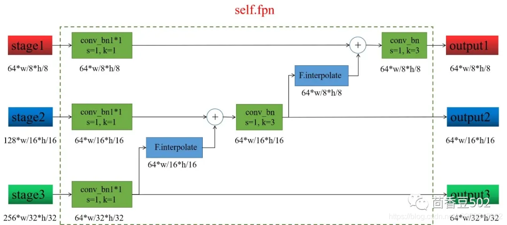
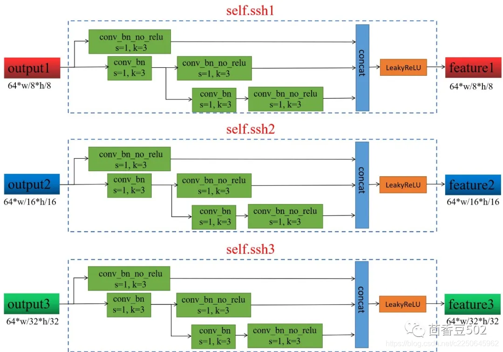
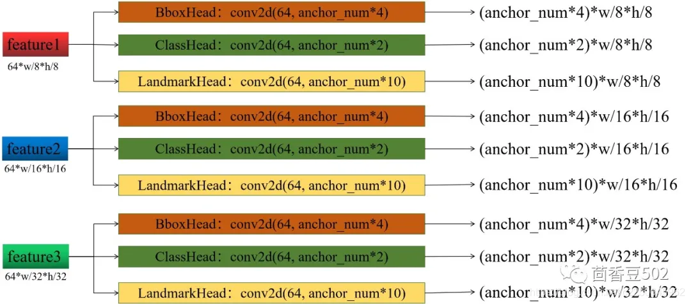

## Retinaface-PyTorch-onnx-trt: Retinaface的PyTorch版本训练及TRT模型转换和Triton Server部署.

### 目录

1. [模型结构 Structure](#模型结构)
2. [性能情况 Performance](#性能情况)
3. [注意事项 Attention](#注意事项)
4. [所需环境 Environment](#所需环境)
5. [文件下载 Download](#文件下载)
6. [预测步骤 How2predict](#预测步骤)
7. [训练步骤 How2train](#训练步骤)
8. [评估步骤 Eval](#评估步骤)
9. [参考资料 Reference](#Reference)

### 模型结构

**backbone**

**fpn**

  

**ssh**

**output**

 

### 性能情况

| 训练数据集 | 权值文件名称 | 测试数据集 | 输入图片大小 | Easy | Medium | Hard |
| :-----: | :-----: | :------: | :------: | :------: | :-----: | :-----: |
| Widerface-Train | Retinaface_mobilenet0.25.pth | Widerface-Val | 1280x1280 | 88.57% | 85.90% | 73.68% |
| Widerface-Train | Retinaface_resnet50.pth | Widerface-Val | 1280x1280 | 94.54% | 92.78% | 82.42% |

### 注意事项

本库下载过来可以直接进行预测，已经在model_data文件夹下存放了Retinaface_mobilenet0.25.pth文件，可用于预测。  

如果想要使用基于resnet50的retinaface请下载Retinaface_resnet50.pth进行预测。 

### 所需环境

pytorch>=1.2.0

### 文件下载

训练所需的Retinaface_resnet50.pth文件可以在百度云下载。

链接: https://pan.baidu.com/s/1Cbd6Jm4jGa2yDCh9GaIs6g  密码: msb5

训练所需的mobilenetV1X0.25_pretrain.tar文件可以在百度云下载。

链接: https://pan.baidu.com/s/1PEnV46wrK7amz11JqF5GvQ  密码: ji3r

数据集可以在如下连接里下载。      
链接: https://pan.baidu.com/s/1LIYlK5sVx4qsK9tvEuJ4cw 提取码: 2yvx   
